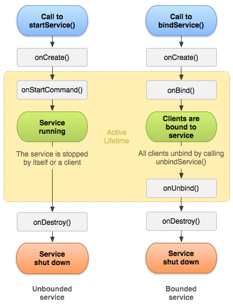

% MAD - Android 7: Services
% Patrick Sturm
% 22.02.2017

## Information

* Any issues with this presentation? Write a ticket or send me a pull request ;).
* Repo: [https://github.com/siyb/tw-mad-7-service](https://github.com/siyb/tw-mad-7-service)

# Agenda

## Agenda

* Introduction
* Service Types
* Excursion: Observer Pattern
* Bound / Started Service
* IntentService

# 

# Introduction


## Introduction - 1 - Resources

* Lesson: 
    * [https://developer.android.com/guide/topics/fundamentals/services.html](https://developer.android.com/guide/topics/fundamentals/services.html)
* Javadoc: 
    * [https://developer.android.com/reference/android/app/Service.html](https://developer.android.com/reference/android/app/Service.html)
    * [https://developer.android.com/reference/android/app/IntentService.html](https://developer.android.com/reference/android/app/IntentService.html)

## Introduction - 2 - Basics

* As Activities and BroadcastReceiver, Services are Android components and need to be defined in AndroidManifest.xml
* Services should be used if a long running operation is performed
* Services do not provide a user interface, meaning that users can only indirectly interact with services (via an Activity for instance)
* If you are implementing a service you still need to execute long running operations in a dedicated thread, as the service runs in the main thread of the hosting process -> block!
* As Activities and BroadcastReceivers, Services can provide intent-filters for implicit Intent handling

```java
<service android:name=".MyService" />
```

# Service Types

## Service Types - 1 - Started / Bound

* Android knows three types of services
    * Bound Service
    * Started Service
    * Bound / Started Service
* Started services need to be stopped manually and should only perform a single task: e.g. database sanitation
* Bound services are bound to components, for instance, Activities
    * Multiple components can bind a service, service will stop automatically if all components unbind the service
    * Interaction with the service is possible via the IBinder interface
* Started / Bound Service
    * A combination of Bound / Started Service
    * First the service is STARTED then it gets BOUND
    * Can be used to interact with a started service
* In general: use a bound service if you want to communicate with it, use a started service if you only want to get work done

## Service Types - 2 - Different Lifecycles



## Service Types - 3 - Other Differences

* Started services run indefinitely until stopped
    * Started services can be stopped from within using the stopSelf() method, as shown in the MyStartedService example code
    * You may also use the stopService(...) method, available via the Context interface (e.g. from an Activity)
* Bound services run as long as there are components bound to them
    * use unbindService(...)
    * bind / unbind a service in onResume / onPause, remember: onPause is the last guaranteed method to be called in case of Activity destruction!
* Started / Bound services run until both criteria are met!

# Excursion: Observer Pattern

## Excursion: Observer Pattern - 1 - Explanation 

* Used to provide callback to registered observers
    * Contains an Observable Object
    * And 0 to N Observers
* Observable holds a list of Observers (or a single Observer instance)
    * In addition, a method to register Observers is provided
    * Each Observer must implement a certain interface
* When an action in Observable is complete, the Observable will call a method (which has been declared in the interface) on each Observer instance
* The Observer knows what’s happening now!

# Bound / Started Service

## Bound / Started Service - 1 - Example: Bound Service

```java
public class MyService extends Service { 
  private int id = 0; 
  private IBinder myBinder; 
  @Override 
  public IBinder onBind(Intent intent) { 
    if (myBinder == null)
      myBinder = new MyBinder(); 
    return myBinder; 
  } 
  public class MyBinder extends Binder { 
    public int getId() { 
      return id; 
    } 
  } 
}
```

## Bound / Started Service - 2 - Example: Binding from Activity

```java
public class MyServiceActivity extends Activity {
  private TextView display;
  private ServiceConnection connection;
  @Override protected void onResume() { 
    super.onResume(); 
    bindService(new Intent(this, MyService.class), 
    (connection = 
      new MyServiceConnection(this)), BIND_AUTO_CREATE); 
  }
  @Override 
  protected void onPause() { 
    super.onPause(); 
    if (connection != null) 
      unbindService(connection);
    } 
  }
}
```

## Bound / Started Service - 3 - Example: Binding from Activity cont.

```java
public class MyServiceConnection implements ServiceConnection { 
  private MyServiceActivity a; 
  public MyServiceConnection(Activity a) { this.a = a; }
  @Override 
  public void onServiceConnected(ComponentName name, 
    IBinder service) { 
    if (service instanceof MyBinder) { 
      int id = ((MyBinder) service).getId(); 
      a.display.setText("Service id is: " + id);
    } 
  } 
  @Override 
  public void onServiceDisconnected(ComponentName name) { 
  }
} 
```

## Bound / Started Service - 4 - Example: Started Service

```java
public class MyStartedService extends Service { 
  private static final Logger LOGGER = 
    LoggerFactory.getLogger(MyStartedService.class); 
  public static final 
    String INTENT_EXTRA_ITERATIONS = "ITERATIONS"; 
  @Override public IBinder onBind(Intent intent) { 
    return null;
  } 
  @Override 
  public int onStartCommand(Intent intent, int flags, int startId) { 
    int c = intent.getIntExtra(INTENT_EXTRA_ITERATIONS, -1); 
    iterate(c); 
    return START_NOT_STICKY; 
  } 
  ...
}
```

## Bound / Started Service - 5 - Example: Started Service cont.

```java
  public void iterate(final int c) { 
    Thread t = new Thread() { 
      @Override public void run() { 
        LOGGER.error("ITERATING: "+ c); 
        stopSelf(); 
      } 
    }; 
    t.start(); 
  } 
```

## Bound / Started Service - 6 - Example: Starting From Activity

```java
public class MyStartedServiceActivity extends Activity { 
  @Override 
  protected void onCreate(Bundle savedInstanceState) { 
    super.onCreate(savedInstanceState); 
    setContentView(R.layout.mystartedserviceactivity); 
    Intent i = new Intent(this, MyStartedService.class); 
    i.putExtra(
      MyStartedService.INTENT_EXTRA_ITERATIONS, 
      5
    ); 
    startService(i); 
  } 
}
```

# IntentService

## IntentService - 1 - Introduction

* An IntentService is a special kind of started service
* Extend the IntentService class in order to make use of it
* IntentService is special
    * All Intents passed to onStartCommand(…) will be executed in a (single!) dedicated worker thread
    * Queues Intents and processes each Intent seperatly
    * Will stop automatically once all Intents in the queue have been processed, no need to handle Service stopping yourself
* The only method you have to implement is onHandleIntent(Intent intent)

## IntentService - 2 - Example

```java
public class MyIntentService extends IntentService { 
  private static final String NAME ="MYINTENTSERVICE"; 
  public static final String INTENT_EXTRA_SHOULDUPDATE = 
    "INTENT_EXTRA_SHOULDUPDATE"; 
  public MyIntentService() { 
    super(NAME); 
  } 
  @Override 
  protected void onHandleIntent(Intent intent) { 
  if (intent.getBooleanExtra(
    INTENT_EXTRA_SHOULDUPDATE, false))
    // Run update here 
  }  
} 
```

# Any Questions?
